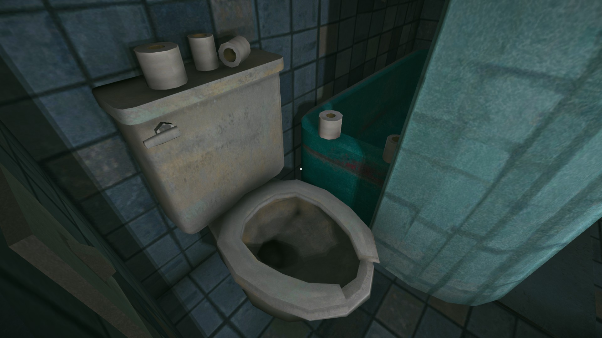
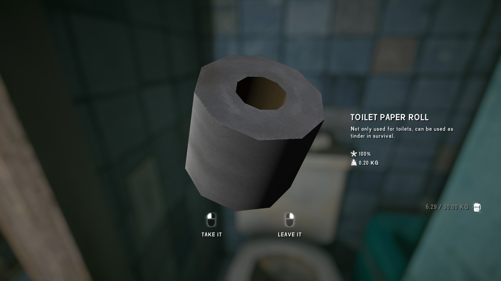
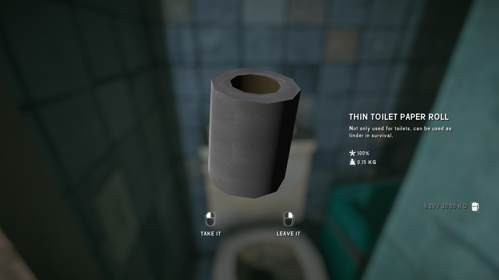

# ToiletPaper
Add toilet paper to The Long Dark. 
I created this little mod to write [a tutorial on how to create a TLD item mod](https://github.com/stmSantana/ModComponentDocs).

- **Loot:** You can also find it in drawers and cabinets. 
- **Spawn:** Items can be found in toilets around the world. 
 (**NOTE:** *Gearspawner spawns all gear only on the first visit to each location. In other words, all mod items will not spawn in locations you have already visited.*)

### Adding Items
Using the [DeveloperConsole](https://github.com/FINDarkside/TLD-Developer-Console) CupRamen can be manually added to your inventory with the command `add toiletpapera` or `add toiletpaperb`.
The item is fully integrated into the console and will appear in the auto-complete when pressing tab.

## Installation
* If you haven't done so already, install MelonLoader by downloading and running [MelonLoader.Installer.exe](https://github.com/HerpDerpinstine/MelonLoader/releases/latest/download/MelonLoader.Installer.exe)
* Install the latest version of [ModComponent](https://github.com/ds5678/ModComponent) and its dependencies.
* Download latest version of `Items_TP.modcomponent` from the [releases page](https://github.com/stmSantana/ToiletPaper/releases/latest).
* Move `Items_TP.modcomponent` to your mods folder.

## Special Thanks
The Long Dark Modding Server (discord)
